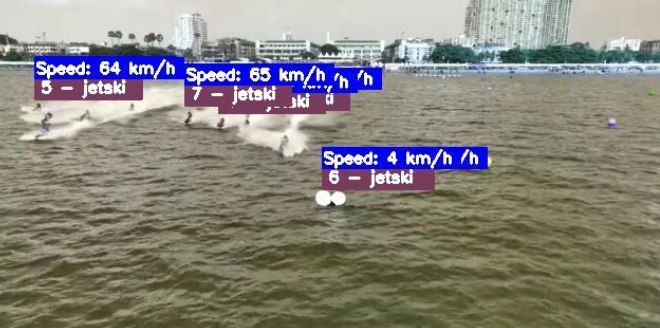

# JetSki Tracking System

[]()
[]()

Computer vision system for detecting and tracking jetskis in video streams using YOLOv8.

 


## Features

- Real-time jetski detection and tracking
- Configurable model parameters
- Video processing pipeline
- Automatic model downloading
- Dataset validation

[](https://youtu.be/h9xav_e5E-g?si=sa9dRcNGvkea0YX4)
[](https://youtu.be/Kez-a69PmYw?si=n7AmAvH1gUB1RvAD)
[](https://youtu.be/lqbCLLoPEzM?si=x4Jzd0Su3FbrsJJ_)


## Installation

```bash
pip install jetski-tracker
```

For development:
```bash
pip install -e .[dev]
```

## Quick Start

```python
from jetski_tracker import bootstrap_application

app = bootstrap_application()
app.execute_workflow("jetski_video.mp4")
```

## Configuration

Create a custom configuration:

```python
from jetski_tracker import ConfigManager

config = {
    'base_model': 'yolov8s.pt',
    'data_path': 'custom_datasets/',
    'epochs': 20
}

app = JetSkiTrackingApp.with_config(config)
```

## Testing

Run the test suite:
```bash
pytest tests/
```

## Documentation

Full API documentation available in [docs/api.md](docs/api.md)
